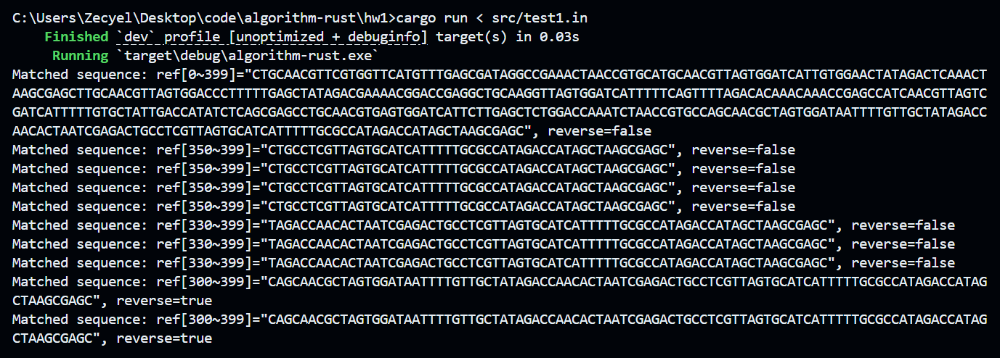

# Algorithm 2025 Lab1


| Title            | Student Name    | Student ID  | Date      |
| ---------------- | --------------- | ----------- | --------- |
| DNA seq-matching | Zecyel (朱程炀) | 23300240014 | 2025.3.26 |


## 1. 实验结果



## 2. 算法原理

首先将 reference 序列的所有字串进行哈希。将所有的哈希值放入哈希表。接着对 reference 倒序之后重复该操作。

注意，不要让逆序的字串覆盖掉原串的哈希值，所以要使用 `Rust` 中的 `map.entry(hash).or_insert`。

之后使用动态规划。$dp[i]$ 表示从第一个字符到第 $i$ 个字符，至少需要使用多少段。初始化将 $dp$ 数组全部设置为 $+inf$。如果 query 序列的 $i .. j$ 部分在哈希表中能找到，那么可以更新 $dp[j] \leftarrow \min(dp[j], 1+dp[i-1])$。之后 $dp[query.len]$​​ 即为最少段数，反向推断出最优结果即可。需要注意更新顺序。

伪代码：

```
function InsertHash(hashTable, A)
	for i := 1 to A.len
		for j := i to A.len
			curHash := calc hash(A[i..j]) from hash(A[i..j-1])
			if curHash not in hashTable
				hashTable.insert(curHash, (i, j))
	return hashTable

function DP(hashTable, query)
	dp[0] = 0
	dp[1..query.len] = +inf
	prev[1..query.len] = null
	for i := 1 to query.len
		for j := i to query.len
			curHash := calc hash(query[i..j]) from hash(query[i..j-1])
			if curHash not in hashTable
				break
			if 1 + dp[i-1] < dp[j]:
				dp[j] = dp[i-1]
				prev[j] = (i, hashTable[curHash])
	return prev

function GetAnswer(P)
	Ans = []
	pos = query.len
	while pos > 0
		Ans.append(P[pos].second)
		pos = P[pos].first
	return Ans.reverse

function Main(ref, query)
	hashTable = new hashtable()
	InsertHash(hashTable, ref)
	InsertHash(hashTable, DNAReverse(ref))
	GetAnswer(DP(hashTable, query))
```

完整的代码请参考 [GitHub 仓库](https://github.com/34-3021/algorithm-rust)。

## 3. 复杂度分析

### 3.1 时间复杂度

第一步的哈希，通过消除重复计算，可以在 $O(n^2)$ 的时间内得到。

第二步的动态规划，可以在 $O(m^2)$ 的时间内得到。最后一步的反向推出答案路径，时间复杂度是 $O(m)$。

总的时间复杂度是  $O(n^2+m^2)$。

### 3.2 空间复杂度

哈希表的空间复杂度是 $O(n^2)$ ，动态规划的空间复杂度是 $O(m)$ 。

## 4. 课程心得

Thanks to TA's assistant, or the PJ would have been completed much earlier.